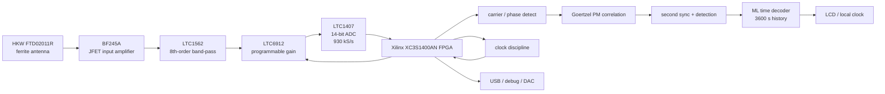

# DCF77 Engeler receiver recreation

Reconstruction project for the DCF77 receiver/decoder described by Daniel Engeler in **Performance Analysis and Receiver Architectures of DCF77 Radio-Controlled Clocks** (IEEE TUFFC, 2012).

The objective of this repository is not merely to decode the conventional DCF77 amplitude pulse. It is to recreate, as closely as practical, the high-performance demonstration receiver from the paper: ferrite antenna and analog front-end, digitisation at 12 × 77.5 kHz, carrier/AM/PM processing, second/minute synchronisation, and the one-hour maximum-likelihood (ML) time decoder.

The original paper is kept only as a source document and has been moved to [`archive/papers/Engeler_DCF77.pdf`](archive/papers/Engeler_DCF77.pdf). The implementation-oriented documentation below is a paraphrased engineering reconstruction of the paper.

## Documentation

- [`docs/01-dcf77-signal.md`](docs/01-dcf77-signal.md) — DCF77 AM/PM symbols and frame layout.
- [`docs/02-receiver-architecture.md`](docs/02-receiver-architecture.md) — complete receiver data path and implemented demonstration architecture.
- [`docs/03-goertzel-detector.md`](docs/03-goertzel-detector.md) — Goertzel carrier/AM/PM detector, synchronisation and fixed-point implementation notes.
- [`docs/04-time-decoder.md`](docs/04-time-decoder.md) — conventional BCD decoder and the ML decoder used by the demonstration receiver.
- [`docs/05-clock-sync-noise.md`](docs/05-clock-sync-noise.md) — clock discipline, burst-noise rejection and clock-leakage mitigation.
- [`docs/06-hardware.md`](docs/06-hardware.md) — component inventory and hardware constraints recoverable from the paper.
- [`docs/07-performance-targets.md`](docs/07-performance-targets.md) — performance figures, sensitivity, timing and range targets.
- [`docs/08-reconstruction-plan.md`](docs/08-reconstruction-plan.md) — practical staged plan to rebuild and validate the receiver.
- [`docs/09-gaps-and-open-questions.md`](docs/09-gaps-and-open-questions.md) — information that is **not** present in the paper and must be recovered or redesigned.
- [`docs/references.md`](docs/references.md) — primary source and useful references cited by Engeler.

## Demonstration receiver in one diagram

## Key target values from the paper

| Item | Target / implementation value |
|---|---:|
| DCF77 carrier | 77.5 kHz |
| ADC rate | 930 kS/s = 12 × carrier |
| ADC | LTC1407, 14 bit |
| FPGA | Xilinx XC3S1400AN |
| ML history | 3600 s |
| Goertzel AM 3 dB bandwidth | ~15 Hz |
| Goertzel PM 3 dB bandwidth | ~930 Hz |
| PM correlation processing | carrier / 20 = 3.875 kHz |
| Clock target after discipline | ~0.1 ppm |
| Demonstration-receiver design accuracy | ~1 ms |
| Measured spread of 54 first-sync tests | 362 µs |
| Demonstration receiver operating point | about Eb/N0 > 7.4 dB |
| ML decoder maximum BER after 1 h | about 0.34 |

## Important reconstruction limitation

The paper is an architecture/performance paper, **not a complete construction dossier**. It identifies the major ICs and gives the DSP architecture, rates and many performance numbers, but it does not publish the complete schematic, PCB artwork, filter component values, antenna tuning values, FPGA source, oscillator part number, exact gain table, or the exact DCF77 PM pseudo-random sequence generator. These gaps are listed explicitly in [`docs/09-gaps-and-open-questions.md`](docs/09-gaps-and-open-questions.md) so that this repository does not present inferred details as if they were documented facts.

## Recommended project strategy

Rebuild the system incrementally. First prove reception and ADC capture, then AM detection, then carrier phase and PM correlation, then second/minute synchronisation, and only then add the ML decoder and clock discipline. This keeps analog, FPGA and algorithmic faults separable during bring-up.
