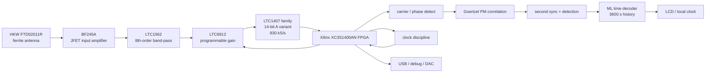

# DCF77 Engeler receiver recreation

Reconstruction project for the DCF77 receiver/decoder described by Daniel Engeler in **Performance Analysis and Receiver Architectures of DCF77 Radio-Controlled Clocks** (IEEE TUFFC, 2012).

The objective of this repository is not merely to decode the conventional DCF77 amplitude pulse. It is to recreate, as closely as practical, the high-performance demonstration receiver from the paper: ferrite antenna and analog front-end, digitisation at 12 × 77.5 kHz, carrier/AM/PM processing, second/minute synchronisation, and the one-hour maximum-likelihood (ML) time decoder.

The original paper is kept only as a source document under [`archive/papers/Engeler_DCF77.pdf`](archive/papers/Engeler_DCF77.pdf). The Markdown documentation is an implementation-oriented engineering reconstruction of the paper plus authoritative PTB/manufacturer material needed to fill gaps that the article does not contain.

## Documentation

- [`docs/01-dcf77-signal.md`](docs/01-dcf77-signal.md) — DCF77 AM/PM symbols and frame layout.
- [`docs/02-receiver-architecture.md`](docs/02-receiver-architecture.md) — complete receiver data path and demonstration architecture.
- [`docs/03-goertzel-detector.md`](docs/03-goertzel-detector.md) — Goertzel carrier/AM/PM detector, synchronisation and fixed-point implementation notes.
- [`docs/04-time-decoder.md`](docs/04-time-decoder.md) — conventional BCD decoder and the ML decoder used by the demonstration receiver.
- [`docs/05-clock-sync-noise.md`](docs/05-clock-sync-noise.md) — clock discipline, burst-noise rejection and clock-leakage mitigation.
- [`docs/06-hardware.md`](docs/06-hardware.md) — recovered hardware, part-number clarification and reconstruction status.
- [`docs/07-performance-targets.md`](docs/07-performance-targets.md) — performance figures, sensitivity, timing and range targets.
- [`docs/08-reconstruction-plan.md`](docs/08-reconstruction-plan.md) — staged plan to rebuild and validate the receiver.
- [`docs/09-gaps-and-open-questions.md`](docs/09-gaps-and-open-questions.md) — remaining unknowns, with resolved items separated from genuine gaps.
- [`docs/10-dcf77-pm-prn.md`](docs/10-dcf77-pm-prn.md) — exact PTB PRN/PZF generator, timing and PM minute marker.
- [`docs/11-analog-reference-design.md`](docs/11-analog-reference-design.md) — first buildable analog front-end proposal and BOM.
- [`docs/references.md`](docs/references.md) — Engeler, PTB and manufacturer sources.

Useful implementation tool:

- [`tools/dcf77_prn.py`](tools/dcf77_prn.py) — executable 512-chip DCF77 PM sequence generator with verification invariants.

## Demonstration receiver in one diagram



## Key target values

| Item | Target / implementation value |
|---|---:|
| DCF77 carrier | 77.5 kHz |
| ADC rate | 930 kS/s = 12 × carrier |
| ADC | LTC1407 family, 14-bit A variant |
| FPGA | Xilinx XC3S1400AN in the historical receiver |
| ML history | 3600 s |
| Goertzel AM 3 dB bandwidth | ~15 Hz |
| Goertzel PM 3 dB bandwidth | ~930 Hz |
| PM correlation processing | carrier / 20 = 3.875 kHz |
| PRN chip rate | carrier / 120 = 645.833... Hz |
| PRN length | 512 chips |
| PRN active window | 200 ms to ~992.774 ms |
| PM phase excursion | approximately ±13° in the PTB/Engeler-era description |
| Clock target after discipline | ~0.1 ppm |
| Demonstration-receiver design accuracy | ~1 ms |
| Measured spread of 54 first-sync tests | 362 µs |
| Demonstration receiver operating point | about Eb/N0 > 7.4 dB |
| ML decoder maximum BER after 1 h | about 0.34 |

## Current reconstruction status

### Resolved

- full paper converted into implementation-oriented Markdown;
- source PDF archived away from the repository root;
- DCF77 PM/PZF generator recovered from PTB documentation;
- 512-chip reference generator implemented in Python;
- first LTC1562 77.5 kHz resistor set derived from the manufacturer's 8th-order band-pass application;
- 14-bit LTC1407 family ambiguity narrowed to an `A` variant;
- first analog prototype architecture and bring-up procedure documented.

### Still to recover or choose

- exact FTD02011R electrical parameters used by Engeler;
- original BF245A bias/topology;
- original LTC1562 resistor values;
- LTC6912 suffix;
- exact LTC1407A suffix and any separate ADC driver;
- oscillator/clock-tree part numbers;
- original PCB/Gerbers and connector details;
- FPGA HDL and fixed-point constants.

These remaining gaps are tracked in [`docs/09-gaps-and-open-questions.md`](docs/09-gaps-and-open-questions.md).

## First buildable analog proposal

The initial rebuild described in [`docs/11-analog-reference-design.md`](docs/11-analog-reference-design.md) deliberately distinguishes recovered facts from new engineering choices.

Its starting point is:

```text
77.5 kHz ferrite antenna
 -> BF245A high-impedance buffer
 -> LTC1562 8th-order band-pass
 -> LTC6912 PGA
 -> explicit ADC drive/common-mode stage
 -> LTC1407A-family 14-bit ADC @ 930 kS/s
 -> FPGA
```

The first-pass LTC1562 target values derived from the 80 kHz manufacturer application are approximately:

```text
RIN1                  4.79 kOhm
RQ1                   47.9 kOhm
R21                   12.8 kOhm
RIN2/RIN3/RIN4        47.9 kOhm
RQ2/RQ3/RQ4           47.9 kOhm
R22/R23/R24           12.8 kOhm
```

This yields an intentionally generous analog bandwidth around 7.75 kHz so the PM sidebands are preserved during initial development.

## PM generator now fully specified

The PTB generator used by DCF77 is reconstructed in [`docs/10-dcf77-pm-prn.md`](docs/10-dcf77-pm-prn.md):

```text
9-stage register
feedback taps 5 XOR 9
polynomial x^9 + x^5 + 1
512 balanced chips
fchip = 77,500 / 120 Hz
start = second + 200 ms
data 1 = inverted sequence
seconds 0-9 = ten inverted sequences for minute identification
```

Run:

```bash
python3 tools/dcf77_prn.py --verify
```

to generate and sanity-check the reference sequence before implementing it in HDL.

## Reconstruction policy

The paper is an architecture/performance paper, **not a complete construction dossier**. This repository therefore labels information by origin:

- facts directly present in Engeler;
- facts recovered from PTB primary sources;
- manufacturer data-sheet facts;
- secondary evidence requiring validation;
- explicit new reconstruction choices.

The goal is to produce a receiver that can actually be rebuilt without silently presenting guessed circuitry as historical fact.

## Recommended project strategy

Rebuild the system incrementally:

1. characterize/tune the ferrite antenna;
2. validate the JFET and LTC1562 chain with a signal generator;
3. capture clean 930 kS/s raw ADC data;
4. implement AM/carrier phase detection;
5. validate the 512-chip PM correlator;
6. implement second/minute synchronisation;
7. add the ML time decoder;
8. add clock discipline;
9. measure self-interference and final timing performance.

Raw ADC recordings should be retained as regression data so later DSP revisions can be tested without changing the RF environment.