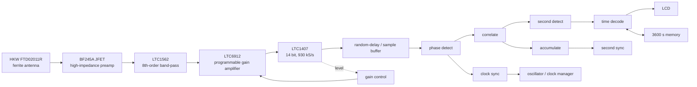

# Receiver architecture

## Implemented demonstration architecture

The receiver actually built for the paper uses a ferrite antenna and analog front-end followed by an FPGA. Engeler reports a **9 cm wide custom PCB** with the antenna mounted above the board.

The FPGA in the published receiver is a **Xilinx XC3S1400AN**. The board also includes a 4-channel **LTC2624 DAC**, USB/debug paths and display output.

## Signal chain roles

### 1. Ferrite antenna

The reference design uses the commercial **HKW FTD02011R** ferrite rod antenna. It is a tuned, high-impedance source and therefore feeds a JFET input stage. The paper notes that tuned ferrite antennas can have about ±200 Hz production tolerance around resonance, which can translate into roughly 100 µs of group-delay variation. For sub-millisecond absolute timing this needs calibration or a different antenna topology.

### 2. JFET input amplifier

A **BF245A** is used at the antenna input. Its job is to sense the high-impedance resonant antenna without excessive loading. The paper does not publish the bias network values; those must be reconstructed independently.

### 3. Analog band-pass

An **LTC1562** implements an **8th-order band-pass filter** before the PGA/ADC. Its purpose is interference reduction and anti-aliasing. The exact resistor/capacitor values and pass-band shape of the built receiver are not given in the paper.

### 4. Programmable gain

An **LTC6912** PGA is controlled by the FPGA. The FPGA continuously adjusts the gain so that weak DCF77 signals exploit ADC range without clipping on strong local signals or interference.

### 5. ADC

The **LTC1407** is run at **930 kS/s**, exactly **12 × 77.5 kHz**, with 14-bit conversion. This phase-coherent relation is important: it simplifies carrier processing and makes one DCF77 carrier cycle exactly 12 ADC samples in the nominal clock domain.

### 6. Digital detector

The demonstration receiver implements the **Goertzel-PM detector**, not the CIC detector, although the paper analyses both. Three Goertzel-derived observables are maintained for:

- carrier/reference phase;
- AM envelope;
- PM phase information.

The output is reduced to soft/hard bit evidence plus synchronisation metrics.

### 7. Time decoder

The FPGA stores up to **3600 seconds of history** and runs the paper's **maximum-likelihood time decoder**. The decoder searches the received history for the most likely current second, minute and hour rather than insisting on two immediately error-free BCD frames.

### 8. Clock discipline

A local low-cost quartz clock is corrected using DCF77 carrier phase. The paper's digital correction loop achieves roughly **0.1 ppm** accuracy from an oscillator that may initially be tens of ppm off. This is necessary because long coherent averaging is otherwise limited by local-clock drift.

### 9. Randomised processing schedule

The FPGA buffers ADC samples and processes them in bursts of random length. This is an EMI technique: fixed FPGA clocks and processing rates can leak back into the antenna and mask the very weak 77.5 kHz signal. Randomising the burst timing spreads those spurs away from the carrier.

## Alternative detector described in the paper: CIC

Engeler also proposes a quadrature zero-IF **CIC detector**:

1. quadrature-mix the ADC signal to baseband;
2. decimate through cascaded CIC stages;
3. form separate PM, AM and carrier bandwidths;
4. use the same synchronisation and time-decoder concepts.

The simulation diagram uses representative processing rates of **930 kHz**, **3875 Hz**, **50 Hz** and **5 Hz** across the decimation chain. The CIC detector has linear phase and stronger out-of-band rejection than the Goertzel implementation, but the physical demonstration board described in the paper uses Goertzel-PM.

## Which architecture should this repository reproduce?

The primary target should be the **demonstration receiver**: the hardware chain shown above plus the Goertzel-PM detector and ML decoder. A CIC version can be added later as a comparative digital implementation once a reproducible ADC capture and test-vector suite exists.
