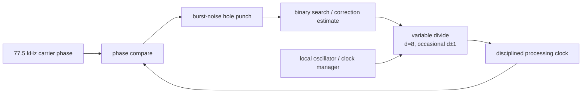

# Clock discipline, noise handling and self-interference

## Why the local clock matters

Long coherent averaging is only useful if receiver timing stays aligned with the DCF77 carrier. Engeler reports that, for the Goertzel-PM detector:

- ~1 ppm local-clock error costs about 0.5 dB in required Eb/N0;
- ~10 ppm costs about 6 dB;
- ordinary uncompensated quartz oscillators can start around ±20 to ±50 ppm.

The demonstration receiver therefore disciplines its digital clock to the received 77.5 kHz carrier.

## Digital clock-correction principle

A fast internal clock is nominally divided by **d = 8**. Occasionally one divide interval is changed to `d-1` or `d+1`. By inserting or skipping one fast-clock period every `N` cycles, the average derived frequency is nudged up or down by a tiny amount.

The paper reports a frequency-adjustment resolution of about **0.003 ppm** and a final clock accuracy around **0.1 ppm**.

A binary-search controller compares local phase with DCF77 phase and applies small correction steps. As the estimate converges, the carrier Goertzel filter is narrowed, which increases noise immunity and supports still longer averaging.

## Burst-noise “hole punching”

Atmospheric lightning and local impulsive interference can create isolated large phase errors. The clock loop should not chase these impulses. Engeler's clock-correction path therefore **mutes excessively large phase deviations** before they enter the slow frequency-control search.

This protection is especially important in the clock loop because a wrong frequency correction corrupts many later seconds. The main time decoder can tolerate an occasional damaged second by virtue of the one-hour ML history.

## Clock-induced ADC jitter/distortion

The digital divide adjustment makes sample timing non-uniform at a very small level. The paper estimates the resulting limitations as approximately:

- SNR ceiling around **50 dB**;
- PM timing disturbance up to roughly **0.1%**.

Both are considered negligible relative to the receiver's operating noise floor.

## Clock leakage into the antenna

The demonstration receiver has several periodic activities locked to DCF77-related frequencies:

| Activity | Frequency |
|---|---:|
| ADC sampling | 12 `f_c` |
| Goertzel updates | `f_c` |
| PM correlation | `f_c/20` |
| time-decoder update | 1 Hz |

These clocks and harmonics can escape through power/ground/cables, be picked up by the ferrite antenna, and then be amplified by the receiver itself. This is a critical board-level problem because the wanted signal is extremely weak.

The paper's mitigation is to **buffer ADC samples and process them in bursts of random length**. Randomising when high-activity FPGA work occurs spreads deterministic leakage lines in frequency and moves energy away from the exact carrier.

For a modern recreation, also plan for:

- separated analog/digital supplies or aggressive supply filtering;
- short return paths around the ADC and FPGA;
- shielding of noisy clocks;
- controlled slew rates where possible;
- physical distance between ferrite antenna and FPGA/USB/DC-DC converters;
- a linear bench supply during RF bring-up.

These layout recommendations are engineering additions; the randomised-processing technique is the specific mitigation documented in the paper.

## Noise figures from the paper

For the reference receiver, SPICE analysis including regulators, antenna and analog front-end gives an equivalent internal noise around **6 dB(µV/m/√Hz)** at the carrier at maximum PGA gain. The atmospheric-noise model used for Europe reaches about **9 dB(µV/m/√Hz)** at its pessimistic all-year maximum and can be at least 16 dB lower around noon.

The implication is important: the demonstration receiver's own noise is designed to remain below atmospheric noise, so performance is intended to be propagation/interference limited rather than electronics-noise limited.
