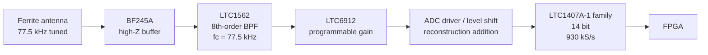

# Analog front-end reference design for the first rebuild

This document turns the hardware information from Engeler into a **buildable first-pass analog design**. It is not claimed to be the unpublished original schematic. Wherever the paper does not give a value, the choice below is explicitly marked as a reconstruction choice.

The goal of this first revision is to preserve the signal content needed by the PM correlator, provide predictable gain and ADC drive, and expose enough test points to debug every stage independently.

## Target signal chain



The explicit ADC driver/level-shift stage is a reconstruction convenience. Engeler's block diagram does not identify this stage separately, so it must not be presented as an original component of the 2012 board.

## 1. Ferrite antenna and tuning

The paper identifies an **HKW FTD02011R** ferrite antenna. The original paper does not publish its inductance or resonating capacitor.

A secondary source that compared HKW DCF77 ferrite antennas reports approximately **897 µH** inductance and approximately **700 Hz antenna bandwidth** for several HKW rods. Treat this only as a starting point until the exact antenna is measured.

For a measured inductance `L`, the parallel resonating capacitor is:

```text
C = 1 / ((2*pi*77,500)^2 * L)
```

For `L = 897 µH`, this gives approximately:

```text
C = 4.70 nF
```

### Prototype tuning network

A practical first build can use:

- `Cfixed = 4.53 nF`, C0G/NP0, 1% or better;
- `Ctrim = 100...300 pF` low-loss trimmer in parallel;
- or a measured/selectable C0G capacitor bank around 4.7 nF.

The better method for the final timing receiver is to **measure L and tune resonance while observing phase**, because absolute PM timing is sensitive to antenna detuning and group delay.

### Expected Q

If the antenna bandwidth is around 700 Hz:

```text
Q ~= 77,500 / 700 ~= 111
```

That is high enough that mechanical placement, nearby conductors and component tolerances matter. Keep the ferrite rod physically away from the FPGA, switch-mode supplies, USB cables and display wiring.

## 2. BF245A input buffer

The BF245A is obsolete, but it is the exact JFET family identified in the paper. NXP specifies the A grade at roughly `IDSS = 2...6.5 mA` and identifies it as a general-purpose LF/HF JFET.

The paper does not publish the bias circuit. The safest first prototype is therefore a **source follower**, because it presents high impedance to the tuned ferrite and is less sensitive to device spread than an aggressively biased common-source gain stage.

### Reconstruction starting values

```text
Q1     BF245A
VDD    +5 V analog
Drain  directly to +5 V
Gate   antenna hot end
RG     10 MOhm gate-to-ground DC return
RS     1.0 kOhm source-to-ground, initial value
Output source node, AC-coupled to the LTC1562 input
```

Recommended assembly options:

- make `RS` replaceable in the range 680 ohm to 2.2 kOhm;
- provide pads for a drain resistor in case a common-source topology is later preferred;
- provide a test point on gate, source and drain;
- do not load the antenna test point with a normal 10x passive oscilloscope probe during final tuning; use an active/high-Z probe or observe after the source follower.

This stage is a **reconstruction choice**, not a recovered original schematic.

## 3. LTC1562 8th-order band-pass

This part is much less ambiguous because Analog Devices/Linear Technology publishes a directly relevant typical application: an **8th-order high-frequency band-pass** using all four second-order sections of the LTC1562.

The published example has:

```text
-3 dB bandwidth = fCENTER / 10
overall gain     = 10
```

The closest tabulated design is at 80 kHz. Because LTC1562 frequency programming is resistor-scaled, a first 77.5 kHz design can be obtained by multiplying the 80 kHz resistor values by:

```text
80 / 77.5 = 1.032258...
```

### Calculated 77.5 kHz resistor targets

| LTC1562 resistor | 80 kHz datasheet value | 77.5 kHz target |
|---|---:|---:|
| `RIN1` | 4.64 kOhm | **4.79 kOhm** |
| `RQ1` | 46.4 kOhm | **47.9 kOhm** |
| `R21` | 12.4 kOhm | **12.8 kOhm** |
| `RIN2`, `RIN3`, `RIN4` | 46.4 kOhm | **47.9 kOhm** |
| `RQ2`, `RQ3`, `RQ4` | 46.4 kOhm | **47.9 kOhm** |
| `R22`, `R23`, `R24` | 12.4 kOhm | **12.8 kOhm** |

Use 0.1% resistors where practical. If exact values are unavailable, use the closest precision value and record the fitted centre frequency.

### Expected first-pass filter response

```text
fCENTER       ~= 77.5 kHz
-3 dB BW      ~= 7.75 kHz
nominal gain  ~= 10
```

This bandwidth is intentionally much wider than the digital AM detector. PTB states that preserving the main PRN spectral lobe alone requires about **1.292 kHz** total bandwidth, and Engeler's PM path relies on phase sidebands. Therefore the analog filter must not be reduced to a 15 Hz-class AM filter.

The final board can be narrowed after measured PM-correlation performance is available, but the first prototype should prioritise preserving phase information.

### Supply and bypass

The LTC1562 supports single or dual supply operation with 5 V to 10 V total supply. For the first prototype, a **single +5 V analog rail** is convenient. In that mode its analog ground reference sits at mid-supply.

Place local bypass capacitors at the IC and follow the datasheet grounding recommendations. Keep the filter physically close to the JFET output and away from FPGA clocks.

## 4. LTC6912 programmable gain

The paper names the LTC6912 but not the suffix.

Two useful variants exist:

| Variant | Gain choices |
|---|---|
| LTC6912-1 | 0, 1, 2, 5, 10, 20, 50, 100 V/V |
| LTC6912-2 | 0, 1, 2, 4, 8, 16, 32, 64 V/V |

For a rebuild whose priority is maximum gain range, **LTC6912-1** is the default recommendation. This is an engineering choice, not a statement about the original board.

The device is inverting and controlled over a 3-wire serial interface. The FPGA AGC should react slowly to ADC headroom and should not attempt to follow the deliberate 100/200 ms DCF77 amplitude reduction.

### Suggested AGC policy for bring-up

Start without AGC:

1. force gain = 1;
2. inject a known 77.5 kHz tone;
3. verify filter response and ADC code range;
4. step manually through all gain settings;
5. only then enable automatic gain changes.

For the first AGC implementation, select the highest gain that keeps the recent absolute ADC peak below roughly 70-80% of full scale. Add hysteresis and update no faster than once per second.

## 5. ADC part-number clarification

Engeler's diagram says **LTC1407, 14 bit**. In the Linear Technology/Analog Devices family, the 14-bit versions are the **LTC1407A / LTC1407A-1**; plain LTC1407 devices are 12 bit.

Therefore the reconstruction BOM should say:

> LTC1407 family, 14-bit A variant; exact suffix on the original board not established from the paper.

For a new build, **LTC1407A-1** is attractive because it provides a bipolar differential input span of approximately `-1.25 V ... +1.25 V` while all physical input pins remain within the 0-3 V supply rails.

The ADC LSB for the 14-bit 2.5 V span is approximately:

```text
2.5 V / 16384 = 153 uV/LSB
```

Engeler's approximate two-LSB weak-signal design target therefore corresponds to only a few hundred microvolts at the ADC input.

## 6. ADC driver / common-mode translation

The LTC1562/LTC6912 analog chain can conveniently operate around a 2.5 V analog-ground point on a 5 V rail, whereas the LTC1407A-1 is a 3 V ADC.

For a reproducible prototype, explicitly add a coupling/driver stage:

```text
PGA output
  -> AC coupling capacitor
  -> 1.5 V ADC common-mode bias
  -> fast rail-to-rail buffer
  -> CH0+
CH0- -> buffered 1.5 V common-mode reference
```

The ADC datasheet recommends a low-output-impedance, fast-settling driver and lists parts such as the LT1632 family. At the full rated throughput the driver guidance is demanding; at the project's lower `930 kS/s` rate the available settling time is larger, but the same low-impedance principle remains useful.

This driver is not shown as a separate block in Engeler and is therefore explicitly a **reconstruction addition**.

## 7. ADC timing

Use:

```text
fADC = 930,000 samples/s = 12 * 77,500 Hz
```

This gives exactly 12 ADC samples per nominal carrier cycle.

The LTC1407A family outputs serial conversion data. Design the FPGA interface so `CONV`, `SCK` and sample capture are generated from the same master clock domain used by the detector. Keep the conversion-start phase deterministic.

During bring-up, only one ADC channel is required for the receiver path. The second simultaneous channel can be useful for diagnostics, such as monitoring a reference or a second analog node.

## 8. Power-tree proposal for prototype 1

This is a rebuild proposal, not recovered original power circuitry.

```text
5V_A   -> BF245A, LTC1562, LTC6912
3V0_A  -> LTC1407A-1
3V3_D  -> FPGA I/O / digital support as required
FPGA core rails -> according to selected FPGA
```

Rules:

- derive analog rails from low-noise regulators;
- avoid switch-mode converters near the ferrite antenna;
- if a switching preregulator is necessary, place it far from the antenna and post-regulate locally;
- join analog/digital return currents deliberately near the ADC, not through the antenna return;
- provide current-measurement jumpers for analog stages.

## 9. Required test points

A board intended for this project should expose at least:

| Test point | Purpose |
|---|---|
| `TP_ANT` | tuned ferrite signal, high-Z measurement only |
| `TP_JFET` | buffered antenna signal |
| `TP_BPF` | LTC1562 output |
| `TP_PGA` | programmable-gain output |
| `TP_ADC_IN` | final ADC analog input |
| `TP_CONV` | ADC conversion timing |
| `TP_SCK` | ADC serial clock |
| `TP_ADC_DATA` | raw serial output |
| `TP_77K5_REF` | FPGA-derived/debug carrier reference |
| `TP_AGND` | quiet analog reference |

Also route one FPGA debug output to a connector so internal correlator and second-sync events can be observed on an oscilloscope.

## 10. Bring-up sequence

Do not assemble and debug the entire receiver at once.

### Stage A — filter without antenna

Inject a low-level swept sine into the LTC1562 input and measure:

- centre frequency;
- -3 dB bandwidth;
- gain;
- phase versus frequency;
- clipping level.

### Stage B — PGA and ADC

Inject 77.5 kHz at several amplitudes. Verify every gain code and confirm raw 14-bit sample capture at 930 kS/s.

### Stage C — JFET and antenna

Connect the ferrite front-end only after the downstream path is known-good. Tune the antenna for maximum response/desired phase at 77.5 kHz.

### Stage D — real-air capture

Before any Goertzel or ML decoder work, save raw ADC captures containing at least several minutes of DCF77. Those captures become the regression data set for every later DSP revision.

## 11. First-pass BOM

| Ref/function | Part/value | Status |
|---|---|---|
| Antenna | HKW FTD02011R if obtainable | paper reference |
| Antenna C | measured around 4.7 nF for ~897 µH | reconstruction, tune to actual L |
| Q1 | BF245A | paper reference, obsolete |
| `RG` | 10 MOhm | reconstruction starting value |
| `RS` | 1.0 kOhm, socket/options 680R-2k2 | reconstruction starting value |
| BPF | LTC1562 | paper reference |
| BPF resistors | 4.79k / 47.9k / 12.8k set above | calculated from LTC1562 80 kHz application |
| PGA | LTC6912-1 preferred | family from paper; suffix reconstruction choice |
| ADC | LTC1407A-1 preferred | 14-bit family reconstruction choice |
| ADC driver | LT1632-class or equivalent | reconstruction addition |
| analog resistors | 0.1% where frequency/gain critical | rebuild requirement |
| tuning capacitors | C0G/NP0 | rebuild requirement |

## 12. What must be measured before freezing a PCB

The schematic should remain a prototype until these numbers are measured:

- actual antenna inductance and Q;
- antenna resonant frequency with board/fixture present;
- BF245A operating point for several samples;
- LTC1562 centre frequency and phase response with chosen resistor values;
- PGA noise and clipping at all gain settings;
- ADC input common mode and full-scale margin;
- self-generated 77.5 kHz spurs with FPGA, USB and display active;
- PM cross-correlation amplitude from real DCF77 captures.

Only after these measurements should this project create a KiCad schematic and PCB revision intended as the canonical reproduction.

## Sources

- Daniel Engeler, 2012 receiver paper archived in this repository.
- Analog Devices/Linear Technology, LTC1562 data sheet, especially the 8th-order high-frequency band-pass typical application.
- Analog Devices/Linear Technology, LTC6912 data sheet.
- Analog Devices/Linear Technology, LTC1407/LTC1407A and LTC1407-1/LTC1407A-1 data sheets.
- NXP, BF245A/B/C data sheet.
- PTB DCF77 publications for PRN bandwidth and timing requirements.

See [`references.md`](references.md) for links and source notes.